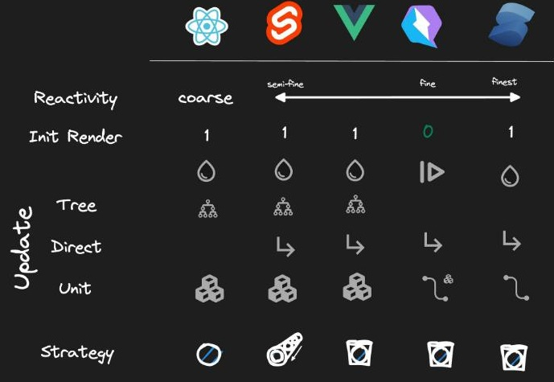

# Reactivity :: Comparision of frameworks

*Unveiling the Magic: Exploring Reactivity Across Various Frameworks*
May 2023, written by Miško Hevery (author of Angular and Qwik)
https://www.builder.io/blog/reactivity-across-frameworks

Have you ever wondered how reactivity works in your favorite framework? Well, you are in luck, as we are going to take a deep dive into reactivity in this article and compare how the frameworks differ to understand them better.

- React, Angular (RxJS)
- Svelte
  - Svelte with stores
- Vue
  - Vue with provide and inject
- Qwik
- Solid


## Reactivity

Reactivity can be broadly defined as the automatic update of the UI due to a change in the application's state. The basic idea is that as a developer, you should only worry about the state of the application and let the framework reflect that state into the UI. But how the framework reflects that state can have implications on the performance and lazy loading of code, so let's dive in.

## Coarse-grained vs. fine-grained

One axis in which we could compare reactivity across frameworks is coarse-grained versus fine-grained reactivity.

*Coarse-grained*: The framework has to execute a lot of application or framework code to determine which DOM nodes need to be updated.

*Fine-grained*: The framework does not need to execute any code and knows exactly which DOM nodes need to be updated.
It should go without saying that this is not a binary thing but rather a continuous dimension that a framework can be on. This is but one of many other axes that one can compare. Also in this article, we will be talking about rendering. Here, rendering will mean the way the framework figures out which DOM to update, not the actual browser rendering that the browser performs as a result of the DOM update.

## My opinion

Here is how I think of the reactivity in this framework. This is not authoritative in any way so let's dive into the discussion of how I came to these conclusions, and perhaps you can come to different conclusions.

```
Coarser <---|-----|-------|---------|--------|---> Finer
React/Angular   Svelte  Vue       Qwik    Solid
```

## Test app

Before we dive into a discussion of how I came to these conclusions, it is useful to define some criteria by which we will compare the behavior of the reactivity between the frameworks. Let's start with the simplest possible application, a counter component. A counter requires a state, an event handler, and a binding to the DOM. All basic primitives with which we build more complex applications.

```js
import { useState } from "react"

export const Counter = () => {
  const [count, setCount] = useState(0)
  return (
    <div>
      Count: {count}
      <button onClick={() => setCount(count + 1)}>+1</button>
    </div>
  )
}
```

However, the above example is too simplistic. In real-world applications, the state, event, and binding are not always in the same component. So let's make the example a little more complicated by breaking it up into finer components to demonstrate how the state storage (Counter), modification of state (Incrementor), and finally, binding of state (Display) can be spread across multiple components.

```js
import { useState } from "react";

export default function Counter() {
  const [count, setCount] = useState(0);
  return (
    <>
      <Display value={count} />
      <Incrementor setCount={setCount} />
    </>
  );
}

function Display({ value }) {
  return <main>{value}</main>;
}

function Incrementor({ setCount }) {
  return <button onClick={() => setCount((v) => v + 1)}>+1</button>;
}
```

We are still missing one more piece common in real-world apps. Let's introduce a Wrapper that is inert and is only used to pass state from the parent Counter component to the child Display component. In real-world applications, inert components are common and we would like to see how the frameworks handle them.

```
            (state)
            Counter
           ↙       ↘
Incrementor         Wrapper (pass-throu)
(mutation)             ↓
                    Display
                    (render)
```


```js
import { useState } from "react";

export default function Counter() {
  const [count, setCount] = useState(0);
  return (
    <>
      <Wrapper value={count} />
      <Incrementor setCount={setCount} />
    </>
  );
}

function Wrapper({ value }) {
  return <Display value={value} />;
}

function Display({ value }) {
  return <main>{value}</main>;
}

function Incrementor({ setCount }) {
  return <button onClick={() => setCount((v) => v + 1)}>+1</button>;
}
```

One final thought: Most frameworks provide mechanisms for improving (fine-tuning) their reactivity for performance. However, in this exploration, I am interested in the "out-of-the-box" behavior of the framework, so those optimizations will be out of scope for our discussion.

## React (and Angular)

Let's start with coarse-grained systems. React (and Angular) is coarse-grained because a change in the state requires re-execution of the component tree. By re-execution, I mean that the application code of the associated components needs to be re-run for the framework to detect changes so that it can update the DOM.

In React, the components need to be re-run to recreate the vDOM, which is then compared to the previous vDOM to determine which DOM elements need to be updated. (In Angular, the components need to re-read the expressions to determine if DOM needs to be updated.)

The actual details are not important, but instead, I want to make the point that the framework does not know which state is bound to which DOM element. Instead, the framework compares current vs. previous vDOM (or values) to detect changes.

Try it out: React Playground
https://stackblitz.com/edit/react-ts-zt2b5n


NOTE: Clicking +1 causes all components to re-render. 1 rendering for hydration + 1 rendering for incrementing the count = 2 renderings.

NOTE: In the above link, notice that each component re-renders (render count increments) each time you interact with the application.

This means that all components that are in the render tree re-execute on each interaction. The corollary is that all of the components need to be downloaded before one can interact with the application. Finally, notice the hydration of the framework cause the initial render count to increment (meaning all of the code ran on startup).

NOTE: The demo is not SSR/SSG, but the behavior would be the same even with SSR/SSG.


## Svelte

Svelte uses a compiler to translate .svelte files into custom code. The compiler is quite clever and efficient in generating the output code.

Try it out: Svelte Playground
https://stackblitz.com/edit/vitejs-vite-bsox6f

On the initial render, Svelte must execute all of the components as part of the hydration, which is the reason why the initial render count is 1. But on subsequent interaction, the counts no longer update. You may think that it is because Svelte is fine-grain reactive, but the reality is a bit more nuanced, so let's dig a bit deeper.

1. Click Open in new window to show the Svelte application as a stand-alone tab so that it is easier to debug.
2. Open Dev tools
3. Disable source maps so that we can get to the generated code.
4. Search for p: function to find all places where Svelte performs change detection.
5. Add log points to each based on the file name. For example, Render: Display.

When you interact with the Svelte application, a click causes `Counter`, `Wrapper`, and `Display` to re-execute, but not `Incermentor`.

```
Render Counter
Render Wrapper
Render Display
```

So Svelte is definitely more fine-grained than React (or Angular) though interaction still causes the components to re-execute. But there is an important distinction. The Svelte example did not cause `Incrementor` to re-execute. This is an important optimization because it allows Svelte to prune tree branches without the developers' involvement. Something possible in React (or Angular) but requires more work from the developer (and we are interested in the "out-of-the-box" behavior.)

I want to point out that the Svelte compiler is doing dirty checking under the hood very efficiently. It requires the Svelte to start with the component where the change was made and then visit all child components where the change propagates, in our case, Counter, Wrapper, and Display.

This means that the code constantly has to re-execute, even though the compiler makes it very efficient, and I don't think it would ever be a performance bottleneck in practice. But the fact that the code constantly re-executes means that all components which are in the render tree can not be lazy-loaded.

## Svelte with stores

Now Svelte compiler only works on .svelte files. This means that if you would like to have reactivity outside of .svelte file, you can't rely on the compiler, and instead, Svelte provides a separate mechanism called stores.

Stores are *observables*, specifically *Behavior-Subjects*, which means that they have current value and deliver the value synchronously to the store subscribers.

The bottom example of Svelte is the same application written with stores.

When you interact with that application and instrument it with log points, you can see that Svelte only re-renders the `Display` component. This is interesting because it shows that Svelte is more efficient with stores than with the compiler (less code needs to execute).

To me, less code to execute is not about performance, but about the fact that the code which does not execute does not need to be downloaded to the client.

>But hydration causes all of the components to run at least once on startup, which means that lazy-loading of code for components in the render tree is not possible.

NOTE: the example does not use SSR/SSG, but the result would be the same even if SSR/SSG were employed.

NOTE: I do find it interesting that Svelte has *two separate reactivity primitives* with different syntax and runtime behavior, as shown in this example. The implication is that moving code from a .svelte to a .js file may require reactivity refactoring, and so may be more involved than just copy-paste.

## Vue

Vue is similar to Svelte in that it *re-runs the components*. Clicking on the increment button causes Counter, Wrapper, and Display to re-run.

Unlike Svelte, Vue does not have compiler-based reactivity; instead, all of its *reactivity is runtime based*. Vue calls the reactivity primitive `Ref`, and it is similar to the `Signal` discussed later.

Try it out: Playground
https://stackblitz.com/edit/vitejs-vite-aamf2c

What I find interesting is that *Vue works by passing reactivity primitives across component boundaries*. It could pass the `Ref` from `Counter` to `Display` through `Wrapper`, but instead, Vue causes the `Ref` to be unwrapped and re-wrapped on component boundaries.

The consequence of this is that the `Wrapper` has to be involved in the re-rendering of `Display` even though the `Wrapper` is just a pass-through. (Later, we will look at *Qwik* and *Solid*, which work differently in this regard.)

The other point to be made with `Ref`s is that unlike Svelte they are not Behavior-Subjects. This means there is *no subscribe API*; instead, the *subscriptions are created implicitly by reading the `Ref` during rendering* (just like `Signal`).

As before, *Vue requires that it hydrates on startup*, and therefore all components in the render tree have to execute once on startup. This means that they have to be downloaded which makes lazy-loading difficult.

NOTE: the example does not use SSR/SSG, but the result would be the same even if SSR/SSG were employed.

## Vue with provide and inject

Vue can pass the `Ref` from `Counter` to `Display`, bypassing `Wrapper`. This is possible by using the `provide` and `inject` API, as shown in the second example. Notice that in this case interacting with the application causes only the `Display` to re-execute, which is a more efficient better behavior.

This difference is passing values between components in .vue files causes `Ref`s to be unwrapped and re-wrapped on component boundaries but `provide`/`inject` allows you to *bypass this (re)wrapping behavior* and directly pass the `Ref` without unwrapping - resulting in a more fine-grained update (similar to Svelte stores).

I would say that Vue is more reactive than Svelte because it only has a *single reactivity model* `Ref` rather than two, as found in Svelte. Moving code from and to .vue files should not require any reactivity refactoring.

## Qwik

Up until now, *all changes happened on the component boundary*. In other words, when a change was detected, at a minimum a component had to be re-executed. A component represents the minimal amount of work to be done (unit of work). However, we can do better than that with **DOM-level reactivity**.

`Qwik` has reactivity on the DOM level.

>When you interact with an app, a `Signal` is connected - not to the associated component - but to the DOM element directly.

Updating a `Signal` directly updates the DOM without executing the associated component.

Because the component is not executed, it can be lazily-downloaded. Savings come more from not downloading the component rather than not executing it.

Qwik has another interesting behavior: *it does not require hydration execution on startup*. Because there is no hydration, no code needs to execute, so no code needs to be downloaded.

Try it out: Playground
https://stackblitz.com/edit/qwik-starter-9mbhi5

In the example, no code is downloaded or executed on the client (outside of the click handler). This is because *Qwik could sufficiently describe the relation between `Signal`s and DOM. This relation was inferred from running the app on the server* (so that the app does not need to run in the browser).

Qwik can't (yet) describe structural changes within Signals. So, for structural changes (like adding/removing DOM nodes), Qwik is forced to download and re-execute the component (not shown in the example).

## Solid

Solid, like Qwik, ties `Signal`s directly to DOM updates. But Solid can also do this, not just for regular values, but *also for structural changes*.

Try it out: Playground
https://stackblitz.com/edit/solidjs-templates-rqp7kj

**Solid executes components exactly once!** The components are never executed again.

This is a very cool property, but like other frameworks, *Solid needs to execute components exactly once on hydration*, which means that all components must be eagerly downloaded and executed on the app startup.

In my view, *Solid has the best reactivity model* because its reactivity is of the finest possible form - always DOM, never component (alas, it still needs hydration, which causes eager code download and execution.)

## Values vs Observables vs Signals

There are generally 3 approaches to reactivity

* **Values**: require some form of "dirty" checking, comparing the current vs previous value. Angular compares expressions, React compares vDOM, Svelte compares expressions with the clever dirty-marking algo done by the compiler.

* **Observables**: used in Angular with *RxJS*, and in Svelte with stores.

* **Signals**: used in Vue (`Ref`), Qwik, and Solid. In Vue, they are connected to components; in Qwik usually to the DOM; in Solid always to the DOM with the DOM being preferred as being more fine-grained.


## Component hierarchy

Angular, React, Svelte, and Vue *follow the component hierarchy when propagating changes to the state*. 
Svelte and Vue can also do direct component updates, but those are not their OOB patterns. 
And these *updates are always on the component level*.

Qwik and Solid *never follow the component hierarchy*, and instead *just update the DOM directly*. 
Solid has an advantage to Qwik concerning structural changes. 
Solid can do DOM updates, whereas Qwik reverts to a single component (not a tree).

## Hydration

>Qwik is unique in that it is the only framework that does not need hydration.

Unlike other frameworks, Qwik does not need to execute all of the components on startup to learn how the state is connected to DOM. Qwik serializes this information on the server (as part of SSR/SSG) and is able to resume on the client.

This *resumability gives Qwik a unique advantage in that Qwik does not need to download most of the app code on startup*, something that hydrating frameworks cannot afford.

So, while I think Solid is more fine-grained than Qwik, I think Qwik's resumability gives it an edge (and who knows, maybe Qwik can become more fined-grained over time).

## Tradeoffs

*Coarse-grain reactivity has the advantage that it just works*. What I mean by that is that it is hard to fall out of the reactivity box. One can read and transform data in any way and it still works.

On the other hand, *Signals require sticking to the rules*. If rules are not followed, then reactivity breaks.

It may appear that coarse-grain is preferable but there is a cost to "just-works" and that is performance. Coarse-grain systems provide an optimization mechanism to prune the tree. On the other hand, Signals don't have optimizations because they are already optimized.

When you do things incorrectly with coarse-grain reactivity, you end up with a slow app, whereas when you do things wrong with Signals, you end up with a broken app. A broken app is preferred because it is an obvious error and straightforward to fix (follow the rules). Whereas a slow app is hard to fix, as there are many thing that could have gone wrong. And when one adds optimizations, one can get them wrong and end up with a broken app anyway.


## Summary




Frameworks     | React    | Svelte | Vue | Qwik | Solid
---------------|----------|--------|-----|------|-------
Initial render | Required | R      | R   | NR   | R
Hydration      | 🌢       | 🌢      | 🌢  | ❘🞂   | 🌢
Update: tree   | ⽊       | ⽊      | ⽊  |      | 
Update: direct |          | ⮡      | ⮡   | ⮡    | ⮡
Update: unit   | A        | A      | A   | Bᐩ    | B
Strategy       | A        | B      | AB  | AB    | AB


## Links

* How reactivity actually works?
https://www.youtube.com/watch?v=XB993rQ-5DY
