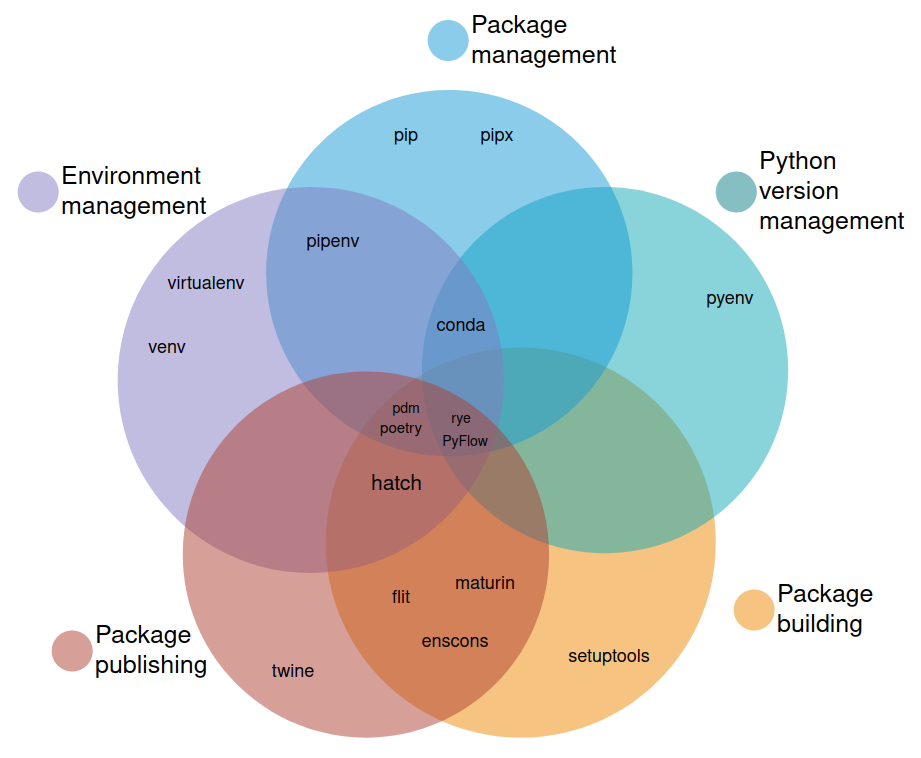

# Python Tools

## Anaconda
Anaconda is curated distribution of python packages regarding data science. Anaconda distribution is a free Python/R data science distribution that contains: conda CLI (package and environment manager), Anaconda Navigator (desktop app built on top of conda, with options to launch other development applications from your managed environments), 250 automatically-installed packages that work well together out of the box, access to the Anaconda Public Repository, with 8000 open-source data science and machine learning packages.

## Anaconda Navigator
a graphical user interface that lets you use `conda` in a web-like interface without having to enter manual commands.

## Conda
Conda provides package, dependency, and environment management. Conda supports creation of sandboxed environments containing files, packages, and their dependencies.

## Conda froge
conda-forge is a community effort and a GitHub organization which contains repositories of conda recipes and thus provides conda packages for a wide range of software. The built distributions are uploaded to anaconda.org/conda-forge and can be installed with conda.

## CPython
https://www.python.org/
CPython is the canonical implementation of Python, i.e. the Python interpreter implemented in the C language.

## Greenlets
https://greenlet.readthedocs.io/en/latest/
Greenlets are lightweight coroutines for in-process sequential concurrent programming. Greenlets can be used on their own, but they are frequently used with frameworks such as *gevent* to provide higher-level abstractions and async I/O. Greenlets are frequently defined by analogy to threads or Python's built-in coroutines (generators and async functions). 

## GraalPy
https://github.com/oracle/graalpython
GraalPy or GraalPython is an implementation of Python 3 built on top of the GraalVM (Graal virtual machine). Primary goal is to support `PyTorch`, `SciPy`, and other data science and machine learning libraries from the Python ecosystem. GraalPy can execute pure Python code faster than CPython, nearly matching the performance of CPython when C extensions are involved. GraalPy currently aims to be compatible with Python 3.10. While many workloads run fine, any Python program that uses external packages could run into trouble. GraalPy is recommended only for experimentation until the compatibility gaps are fixed.

## IronPython
https://ironpython.net/
IronPython is an open-source implementation of Python, tightly integrated into the *.NET* platform. IronPython can use .NET and Python libraries; other .NET languages can use Python code just as easily.

## Miniconda
https://docs.conda.io/projects/miniconda/en/latest/
Miniconda is a free minimal installer for conda. It is a small bootstrap version of `Anaconda` that includes only `conda` and Python, along with some other useful packages including `pip` and `zlib`. To install more, use `conda` and pick from thousands of packages available by default in Anaconda's public repo, or from other channels, like `conda-forge` or `bioconda`.

## pyenv
https://github.com/pyenv/pyenv
pyenv is a tool for installing and maintaining multimple versions of the main Python interpreter (CPython), but it can also install alternative interpreters like PyPy or GraalPython.

## PyPy
https://www.pypy.org/
PyPy is a compliant implementation of Python with the goal to speed up the execution of programs compared to the canonical Python interpreter (CPython) while maintaining compatibility with it. PyPy is built using the `RPython` language that was co-developed with it. PyPy implements Python 2.7.18, 3.9.15, and 3.8.15; it supports the core language and most of the commonly used Python standard library modules. PyPy has a Just-in-Time compiler. It is fast in running most benchmarks - including very large and complicated Python apps, not just 10-liners.

However, PyPy will not be able to speed up execution of code in case of short-running processes (if it doesn't run for at least a few seconds, then the JIT compiler won't have enough time to warm up), and if all time is spent in run-time libraries (i.e. in C functions and not actually running Python code). PyPy works best when executing long-running programs where a significant amount of the time is spent executing Python code.

Support for *Stackless* and *greenlets* is integrated in the normal PyPy.

The devs have also implemented other languages that makes use of our RPython toolchain: Prolog, Smalltalk, JS, Io, Scheme, Gameboy, Topaz (Ruby), HippyVM (PHP).

## Stackless Python
https://en.wikipedia.org/wiki/Stackless_Python
Stackless Python, or Stackless, is a Python interpreter, so named because it avoids depending on the C call stack for its own stack. In practice, Stackless Python uses the C stack, but the stack is cleared between function calls. The most prominent feature of Stackless is *microthreads*, which avoid much of the overhead associated with usual operating system threads. In addition to Python features, Stackless also adds support for coroutines, communication channels, and task serialization.

## Categorization
There are 5 main tooling categories
- Python version management
- Environment management (virtual environments et al.)
- Package management
- Package building
- Package publishing



https://alpopkes.com/posts/python/packaging_tools/

Let's say you are working on a personal project alongside your work projects. At work you're using Python 3.7 whereas your personal project should be using the newest Python version (currently 3.11). In other words: you want to be able to install different Python versions and switch between them. That's what our first category, Python version management is about.

Within your projects you are using other packages (e.g. pandas or sklearn for data science). These are dependencies of your project that you have to install and manage (e.g. upgrade when new versions are released). This is what package management is about.

Because different projects might require different versions of the same package you need to create (and manage) virtual environments to avoid dependency conflicts. Tools for this are collected in the category environment management. Most tools use virtual environments, but some use another concept called "local packages" which we will look at later.

Once your code is in a proper state you might want to share it with fellow developers. For this you first have to build your package (package building) before you can publish it to PyPI or another index (package publishing).


python-build-standalone links libedit instead of readline - some quirks:
- quirks `terminfo` possible
- https://github.com/indygreg/python-build-standalone/blob/main/docs/quirks.rst
- `/usr/{lib,share}/terminfo/`

```bash
ls /lib/terminfo/
# E  a  c  d  h  l  m  p  r  s  t  v  w  x

ls /usr/{lib,share}/terminfo/
# /usr/lib/terminfo/:
# E  a  c  d  h  l  m  p  r  s  t  v  w  x
# /usr/share/terminfo/:
# 1  2  3  4  5  6  7  8  9  A  E  L  M  N  P  Q  X  a  b  c  d
# e  f  g  h  i  j  k  l  m  n  o  p  q  r  s  t  u  v  w  x  z

TERMINFO_DIRS=$HOME/.terminfo:/etc/terminfo:/lib/terminfo:/usr/share/terminfo
```

* `/lib/terminfo/` and `/usr/lib/terminfo/` seems to be the same (symlinks)
* Searching for terminal descriptions in `$HOME/.terminfo` and `TERMINFO_DIRS`

File: `/etc/terminfo/README` says:
  │ This dir is for system-local terminfo descriptions. **By default ncurses**
  | searches `${HOME}/.terminfo` first, then `/etc/terminfo` (this dir),
  | then `/lib/terminfo`, and last not least `/usr/share/terminfo`.


## Python applications

[Python is used for](https://www.python.org/about/apps/)
- Web dev
  - Django
  - Pyramid
  - Bottle
  - Tornado
  - Flask
  - web2py
- GUI development
  - tkInter
  - PyGObject
  - PyQt
  - PySide
  - Kivy
  - wxPython
- Data science
  - NumPy
  - SciPy
  - Pandas
  - IPython
- Software development
  - Buildbot
  - Trac
  - Roundup
- System administration
  - Ansible
  - Salt
  - OpenStack
  - xonsh


## Python filename extensions

- .py     Python source code
- .pyc    Compiled bytecode
- .pyo    Optimized compiled bytecode (Python3.5+ only uses .pyc)
- .pyd    Python script made as a Windows DLL
- .pyw    Python script run in windowed mode executed with `pythonw.exe`
- .pyi    MyPy stub file (PEP 484)
- .pyz    Python ZIP Applications
- .pyzw   Windowed Python ZIP Applications
- .whl    Special zip used for distribution only, widely used by `pip`
- .egg    Special zip used for distribution/import, OBSOLETE since PEP 427
- .pth    Path config file; contents are added to `sys.path`.
- .pyz    Python script archive (PEP 441)
- .pyzw   Python script archive for MS-Windows (PEP 441)
- .pyx    Cython src to be converted to C/C++
- .pxd    Cython modern header for use with cimports.
- .pxi    Cython legacy header for raw text includes.


## Major Python implementations
- CPython
- PyPy
- Stackless Python
- MicroPython
- CircuitPython
- IronPython
- Jython

## Major Python dialects
- Cython
- RPython
- Starlark
