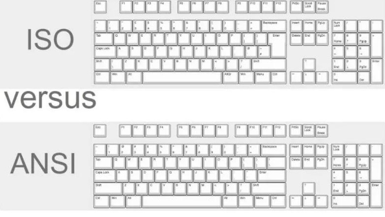

https://keyboardkings.com/ansi-vs-iso-keyboard-layout-conversion-mod/

The **ANSI layout** primarily focuses on English typing and comes with *104 keys* in *standard keyboard size*, or 87 keys in Tenkeyless keyboard design.

The ANSI layout is much more common than any other layout in terms due to the array of benefits and functionalities it provides to most keyboard users and because the American keyboard and peripheral market are incredibly huge compared to others in the world.

The **ISO layout** (International Standards Organization) provides a wide spectrum of languages the ability to be typed because of the keys and the functions' physical arrangement. The ISO layout introduces an extra key which takes the total of ISO keys in a full-sized layout to 105, whereas, in Tenkeyless form, ISO layout keyboards come packed with 88 individual keys. ISO layout keyboards and keycaps aren't ubiquitous worldwide because of their limitations and reduced requirement. There are many ways of tweaking and programming keyboards to type in multiple languages instead of using this layout.

All the differences between ANSI and ISO keyboard layouts:
- left shift key size
- backspace key placement
- enter key size (big-ass enter in iso)
- right alt key usage ( altgr key on iso)
- total number of keys (+1 on iso)

The overall number of keys on *ISO layout full-sized keyboard is 105*, whereas the smaller version comes with 88 keys.

ANSI keyboards in large form-factor come with 104 keys, and their smaller Tenkeyless counterparts come equipped with 87 keys.
