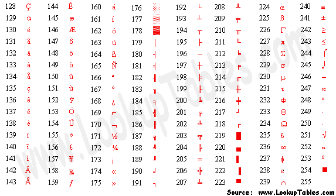

# CS :: Hardware :: Keyboad :: ASCII

ASCII encoding consists of 7 bits that encode 2⁷ = 128 characters. The 8th (hi-bit) is left 0, although it may be used for other things (pairing check). The Extended ASCII encoding uses the remaining 128 characters, up to 1 bytes (8 bits), but these encodings are not standardizes - many countries use their own code page.

Extended ASCII is a repertoire of character encodings that include (most of) the original 96 ASCII character set, plus up to 128 additional characters. There is no formal definition of the term "extended ASCII", and its use is often ambiguous. There are many extended ASCII encodings - the additional 128 palces are used differently across countries - these are called *codepages*, and there is more than 220 (DOS and Windows) codepages defined (with names like "ISO Latin 1")


0  - 7F  Extended EASCII set (8 bits): 256 characters

0  - 7F  Basic ASCII set (7 bits): 128 characters
7F - FF  Extended part of the EASCII set: additional 128 characters

0 - 7F  The 128 characters of the ASCII set (7 bits, 128 chars)

0 - 1F  Device Control characters, DC1 set
        (2×16+1 chars: 0x0 - 0x0F, 0x10 - 0x1F, 0x7F DEL)


80 - 9F Device Control characters, DC2 set
         (2×16 chars: 0x8F - 0x8F, 0x90 - 0x9F)
A0 - FF E-ASCII part: 128 additional chars (accents, drawing, etc.)


- C-escapes
- English names
- ^-escapes
- ASCII mnemonics
- numerics in dec/octal/hex


Basic ASCII

```
Dec Hex    Dec Hex    Dec Hex  Dec Hex  Dec Hex  Dec Hex   Dec Hex   Dec Hex
  0 00 NUL  16 10 DLE  32 20    48 30 0  64 40 @  80 50 P   96 60 `  112 70 p
  1 01 SOH  17 11 DC1  33 21 !  49 31 1  65 41 A  81 51 Q   97 61 a  113 71 q
  2 02 STX  18 12 DC2  34 22 "  50 32 2  66 42 B  82 52 R   98 62 b  114 72 r
  3 03 ETX  19 13 DC3  35 23 #  51 33 3  67 43 C  83 53 S   99 63 c  115 73 s
  4 04 EOT  20 14 DC4  36 24 $  52 34 4  68 44 D  84 54 T  100 64 d  116 74 t
  5 05 ENQ  21 15 NAK  37 25 %  53 35 5  69 45 E  85 55 U  101 65 e  117 75 u
  6 06 ACK  22 16 SYN  38 26 &  54 36 6  70 46 F  86 56 V  102 66 f  118 76 v
  7 07 BEL  23 17 ETB  39 27 '  55 37 7  71 47 G  87 57 W  103 67 g  119 77 w
  8 08 BS   24 18 CAN  40 28 (  56 38 8  72 48 H  88 58 X  104 68 h  120 78 x
  9 09 HT   25 19 EM   41 29 )  57 39 9  73 49 I  89 59 Y  105 69 i  121 79 y
 10 0A LF   26 1A SUB  42 2A *  58 3A :  74 4A J  90 5A Z  106 6A j  122 7A z
 11 0B VT   27 1B ESC  43 2B +  59 3B ;  75 4B K  91 5B [  107 6B k  123 7B {
 12 0C FF   28 1C FS   44 2C ,  60 3C <  76 4C L  92 5C \  108 6C l  124 7C |
 13 0D CR   29 1D GS   45 2D -  61 3D =  77 4D M  93 5D ]  109 6D m  125 7D }
 14 0E SO   30 1E RS   46 2E .  62 3E >  78 4E N  94 5E ^  110 6E n  126 7E ~
 15 0F SI   31 1F US   47 2F /  63 3F ?  79 4F O  95 5F _  111 6F o  127 7F DEL
```


EXTENDED ASCII: Basic ASCII above plus 128 chars below:




```
Dec Hex    Dec Hex    Dec Hex  Dec Hex  Dec Hex  Dec Hex   Dec Hex   Dec Hex

128 80 NUL  16 90 DLE  32 A0    48 B0 0  64 C0 @  80 D0 P   96 E0 `  112 F0 p
129 81 SOH  17 91 DC1  33 A1 !  49 B1 1  65 C1 A  81 D1 Q   97 E1 a  113 F1 q
130 82 STX  18 92 DC2  34 A2 "  50 B2 2  66 C2 B  82 D2 R   98 E2 b  114 F2 r
131 83 ETX  19 93 DC3  35 A3 #  51 B3 3  67 C3 C  83 D3 S   99 E3 c  115 F3 s
132 84 EOT  20 94 DC4  36 A4 $  52 B4 4  68 C4 D  84 D4 T  100 E4 d  116 F4 t
133 85 ENQ  21 95 NAK  37 A5 %  53 B5 5  69 C5 E  85 D5 U  101 E5 e  117 F5 u
134 86 ACK  22 96 SYN  38 A6 &  54 B6 6  70 C6 F  86 D6 V  102 E6 f  118 F6 v
135 87 BEL  23 97 ETB  39 A7 '  55 B7 7  71 C7 G  87 D7 W  103 E7 g  119 F7 w
136 88 BS   24 98 CAN  40 A8 (  56 B8 8  72 C8 H  88 D8 X  104 E8 h  120 F8 x
137 89 HT   25 99 EM   41 A9 )  57 B9 9  73 C9 I  89 D9 Y  105 E9 i  121 F9 y
138 8A LF   26 9A SUB  42 AA *  58 BA :  74 CA J  90 DA Z  106 EA j  122 FA z
139 8B VT   27 9B ESC  43 AB +  59 BB ;  75 CB K  91 DB [  107 EB k  123 FB {
140 8C FF   28 9C FS   44 AC ,  60 BC <  76 CC L  92 DC \  108 EC l  124 FC |
141 8D CR   29 9D GS   45 AD -  61 BD =  77 CD M  93 DD ]  109 ED m  125 FD }
142 8E SO   30 9E RS   46 AE .  62 BE >  78 CE N  94 DE ^  110 EE n  126 FE ~
143 8F SI   31 9F US   47 AF /  63 BF ?  79 CF O  95 DF _  111 EF o  127 FF DEL
```


## Refs

https://en.wikipedia.org/wiki/ASCII
https://en.wikipedia.org/wiki/Extended_ASCII
https://iconoun.com/articles/collisions/
https://theasciicode.com.ar/
