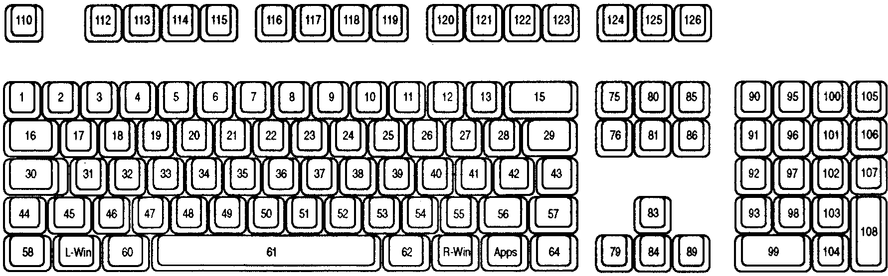

# Keyboard Input Overview

https://learn.microsoft.com/en-us/windows/win32/inputdev/about-keyboard-input

## TOC

- Keyboard Input Model
- Keyboard Focus and Activation
- Keystroke Messages
  - System and Nonsystem Keystrokes
  - Virtual-Key Codes Described
  - Keystroke Message Flags
    - Repeat Count
    - Scan codes
    - Extended-Key Flag
    - Context code
    - Previous key-state flag
    - Transition-state flag
- Character Messages
- Key Status
- Keystroke and Character Translations
- Hot-Key Support
- Keyboard Keys for Browsing and Other Functions
- Simulating Input
- Languages, Locales, and Keyboard Layouts

## Keyboard Input Model

The system provides *device-independent keyboard support* for apps by installing a *keyboard device driver* appropriate for the current keyboard.

The system provides *language-independent keyboard support* by using the *language-specific keyboard layout* currently selected by the user or the app.

The *keyboard device driver* receives *scan codes* from the keyboard, which are sent to the *keyboard layout* where they are translated into messages and posted to the appropriate windows in an app.

Assigned to each key on a keyboard is a unique value called a **scan code**, a device-dependent identifier for the key on the keyboard.

>**Scan code** is a device-dependent identifier for a key on the keyboard.

A keyboard generates *two scan codes* when the user types a key
- one when the user *presses the key*
- and another when the user *releases the key*

The keyboard device driver interprets a scan code and translates (maps) it to a **virtual-key code**, a device-independent value defined by the system that identifies the purpose of a key.

>**Virtual-key code** is a device-independent value defined by the system that identifies the purpose of a key on the keyboard.

After translating a scan code, the keyboard layout creates a message that includes the scan code, the virtual-key code, and other information about the keystroke, and then places the message in the *system message queue*.

The system removes the message from the system message queue and posts it to the message queue of the appropriate thread. Eventually, the thread's message loop removes the message and passes it to the appropriate window procedure for processing.

The following figure illustrates the keyboard input model:

KEYBOARD ----[scancode] ---> 
  KEYBOARD DEVICE DRIVER ----[message]---> 
    SYSTEM MESSAGE QUEUE ----[message]---> 
      THREAD MESSAGE QUEUE ---> 
        THREAD MESSAGE LOOP ---> 
          WINDOW PROCEDURE

## Keyboard Focus and Activation

The system posts keyboard messages to the message queue of the foreground thread that created the window with the keyboard focus.

The *keyboard focus* is a temporary property of a window. The system shares the keyboard among all windows on the display by shifting the keyboard focus, at the user's direction, from one window to another.

The window that has the keyboard focus receives (from the message queue of the thread that created it) all keyboard messages until the focus changes to a different window.

The concept of keyboard focus is related to that of the *active window*. The active window is the top-level window the user is currently working with. The window with the keyboard focus is either the active window, or a child window of the active window. To help the user identify the active window, the system places it at the top of the Z order and highlights its title bar.

## Keystroke Messages

*Pressing a key* causes a WM_KEYDOWN or WM_SYSKEYDOWN message to be placed in the thread message queue attached to the window that has the keyboard focus.

*Releasing a key* causes a WM_KEYUP or WM_SYSKEYUP message to be placed in the queue.

Key-up and key-down messages typically occur in pairs, but if the user holds down a key long enough to start the keyboard's *automatic repeat feature*, the system generates a number of WM_KEYDOWN or WM_SYSKEYDOWN messages in a row. It then generates a single WM_KEYUP or WM_SYSKEYUP message when the user releases the key.

This section covers the following topics:
- System and non-system keystrokes
- Virtual-Key codes described
- Keystroke message flags

### System and non-system keystrokes

The system makes a distinction between system keystrokes and nonsystem keystrokes.

*System keystrokes* produce system keystroke messages, WM_SYSKEYDOWN and WM_SYSKEYUP.

*Nonsystem keystrokes* produce nonsystem keystroke messages, WM_KEYDOWN and WM_KEYUP.

*System keystroke messages* are primarily for use by the system rather than by an application. The system uses them to provide its built-in keyboard interface to menus and to allow the user to control which window is active.

System keystroke messages are generated when the user types a key in combination with the ALT key, or when the user types and no window has the keyboard focus (for example, when the active application is minimized). In this case, the messages are posted to the message queue attached to the active window.

*Nonsystem keystroke messages* are for use by application windows. A window procedure can discard any nonsystem keystroke messages that it does not need.

### Virtual-Key Codes Described

The wParam parameter of a keystroke message contains the virtual-key code of the key that was pressed or released. A window procedure processes or ignores a keystroke message, depending on the value of the virtual-key code.

A typical window procedure processes only a small subset of the keystroke messages that it receives and ignores the rest.

For example, a window procedure might process only WM_KEYDOWN keystroke messages, and only those that contain virtual-key codes for the cursor movement keys, shift keys (also called control keys), and function keys.

A typical window procedure does not process keystroke messages from character keys. Instead, it uses the TranslateMessage function to convert the message into character messages (for more information about TranslateMessage and character messages, see Character Messages).

### Keystroke Message Flags

The `lParam` parameter of a keystroke message contains additional information about the keystroke that generated the message.

This information includes
- key repeat count          0 - 15   (16 bits)
- scan code                16 - 23   (8 bits)
- extended-key flag        24        (1 bit)
- (reserved)               25 - 28   (4 bits)
- context code             29        (1 bit)
- previous key-state flag  30        (1 bit)
- transition-state flag    31        (1 bit)

#### Repeat Count

You can check the repeat count to determine whether a keystroke message represents more than one keystroke.

The system increments the count when the keyboard generates WM_KEYDOWN or WM_SYSKEYDOWN messages faster than an application can process them. This often occurs when the user holds down a key long enough to start the keyboard's automatic repeat feature.

Instead of filling the system message queue with the resulting key-down messages, the system combines the messages into a *single key-down message* and increments the repeat count.

Releasing a key cannot start the automatic repeat feature, so the repeat count for WM_KEYUP and WM_SYSKEYUP messages is always set to 1.

#### Scan Codes

A **scan code** is the value that the system generates when the user presses a key. It is a value that identifies the key pressed regardless of the active keyboard layout, as opposed to the character represented by the key.

An app typically ignores scan codes. Instead, it uses the virtual-key codes to interpret keystroke messages.

Modern keyboards are using *Human Interface Devices* (HID) specification to communicate with a computer. Keyboard driver converts reported HID Usage values sent from the keyboard to scan сodes and passes them on to apps.

While virtual key codes are typically more useful to desktop apps, scan codes might be required in specific cases when you need to know which key is pressed regardless of the current keyboard layout. For example, the WASD (W is up, A is left, S is down, and D is right) key bindings for games, which ensure a consistent key formation across US QWERTY or French AZERTY keyboard layouts.

The following table lists the set of Scan Codes as presently recognized by Windows.

- HID PageName (HID Usage Page Name)
- HID Use Name (HID Usage Name)
- HID Page     (HID Usage Page)
- HID ID       (HID Usage ID)
  values reference [HID Usage Tables](https://www.usb.org/hid)
- Loc          (Key Location)
  values reference the preceding keyboard image (see above)
- Scan         (Scan 1 Make) code is delivered in 
  WM_KEYDOWN / WM_KEYUP, WM_SYSKEYDOWN / WM_SYSKEYUP and WM_INPUT messages

HID PageName    | HID Name                      |HID Page| HID ID | Scan   |Loc
----------------|-------------------------------|--------|--------|--------|---
Consumer        | AL Consumer Control Config    | 0x000C | 0x0183 | 0xE06D |000
Consumer        | AL Email Reader               | 0x000C | 0x018A | 0xE06C |000
Consumer        | AL Local Machine Browser      | 0x000C | 0x0194 | 0xE06B |000
Consumer        | AC Back                       | 0x000C | 0x0224 | 0xE06A |000
Consumer        | AC Forward                    | 0x000C | 0x0225 | 0xE069 |000
Consumer        | AC Stop                       | 0x000C | 0x0226 | 0xE068 |000
Consumer        | AC Refresh                    | 0x000C | 0x0227 | 0xE067 |000
Consumer        | AC Bookmarks                  | 0x000C | 0x022A | 0xE066 |000
Consumer        | AC Search                     | 0x000C | 0x0221 | 0xE065 |000
Generic Desktop | System Wake Up                | 0x0001 | 0x0083 | 0xE063 |000
Generic Desktop | System Sleep                  | 0x0001 | 0x0082 | 0xE05F |000
Generic Desktop | System Power Down             | 0x0001 | 0x0081 | 0xE05E |000
Keyboard/Keypad | Keyboard Power                | 0x0007 | 0x0066 | 0xE05E |000
Consumer        | AC Home                       | 0x000C | 0x0223 | 0xE032 |000
Consumer        | Volume Increment              | 0x000C | 0x00E9 | 0xE030 |000
Consumer        | Volume Decrement              | 0x000C | 0x00EA | 0xE02E |000
Consumer        | Stop                          | 0x000C | 0x00B7 | 0xE024 |000
Consumer        | Play/Pause                    | 0x000C | 0x00CD | 0xE022 |000
Consumer        | AL Calculator                 | 0x000C | 0x0192 | 0xE021 |000
Consumer        | Mute                          | 0x000C | 0x00E2 | 0xE020 |000
Consumer        | Scan Next Track               | 0x000C | 0x00B5 | 0xE019 |000
Consumer        | Scan Previous Track           | 0x000C | 0x00B6 | 0xE010 |000
Keyboard/Keypad | ErrorRollOver                 | 0x0007 | 0x0001 | 0x00FF |000
Keyboard/Keypad | Keyboard LANG3                | 0x0007 | 0x0092 | 0x0078 |000
Keyboard/Keypad | Keyboard LANG4                | 0x0007 | 0x0093 | 0x0077 |000
Keyboard/Keypad | Keyboard F24                  | 0x0007 | 0x0073 | 0x0076 |000
Keyboard/Keypad | Keyboard LANG5                | 0x0007 | 0x0094 | 0x0076 |000
Keyboard/Keypad | Keyboard LANG1                | 0x0007 | 0x0090 | 0x0072 |000
Keyboard/Keypad | Keyboard LANG2                | 0x0007 | 0x0091 | 0x0071 |000
Keyboard/Keypad | Keyboard F23                  | 0x0007 | 0x0072 | 0x006E |000
Keyboard/Keypad | Keyboard F22                  | 0x0007 | 0x0071 | 0x006D |000
Keyboard/Keypad | Keyboard F21                  | 0x0007 | 0x0070 | 0x006C |000
Keyboard/Keypad | Keyboard F20                  | 0x0007 | 0x006F | 0x006B |000
Keyboard/Keypad | Keyboard F19                  | 0x0007 | 0x006E | 0x006A |000
Keyboard/Keypad | Keyboard F18                  | 0x0007 | 0x006D | 0x0069 |000
Keyboard/Keypad | Keyboard F17                  | 0x0007 | 0x006C | 0x0068 |000
Keyboard/Keypad | Keyboard F16                  | 0x0007 | 0x006B | 0x0067 |000
Keyboard/Keypad | Keyboard F15                  | 0x0007 | 0x006A | 0x0066 |000
Keyboard/Keypad | Keyboard F14                  | 0x0007 | 0x0069 | 0x0065 |000
Keyboard/Keypad | Keyboard F13                  | 0x0007 | 0x0068 | 0x0064 |000
Keyboard/Keypad | Keyboard International6       | 0x0007 | 0x008C | 0x005C |000
Keyboard/Keypad | Keypad Equals                 | 0x0007 | 0x0067 | 0x0059 |000
Keyboard/Keypad | Keyboard Grave Accent, Tilde  | 0x0007 | 0x0035 | 0x0029 |001
Keyboard/Keypad | Keyboard 1 and Bang           | 0x0007 | 0x001E | 0x0002 |002
Keyboard/Keypad | Keyboard 2 and At             | 0x0007 | 0x001F | 0x0003 |003
Keyboard/Keypad | Keyboard 3 And Hash           | 0x0007 | 0x0020 | 0x0004 |004
Keyboard/Keypad | Keyboard 4 and Dollar         | 0x0007 | 0x0021 | 0x0005 |005
Keyboard/Keypad | Keyboard 5 and Percent        | 0x0007 | 0x0022 | 0x0006 |006
Keyboard/Keypad | Keyboard 6 and Caret          | 0x0007 | 0x0023 | 0x0007 |007
Keyboard/Keypad | Keyboard 7 and Ampersand      | 0x0007 | 0x0024 | 0x0008 |008
Keyboard/Keypad | Keyboard 8 and Star           | 0x0007 | 0x0025 | 0x0009 |009
Keyboard/Keypad | Keyboard 9 and Left Bracket   | 0x0007 | 0x0026 | 0x000A |010
Keyboard/Keypad | Keyboard 0 and Right Bracket  | 0x0007 | 0x0027 | 0x000B |011
Keyboard/Keypad | Keyboard Dash and Underscore  | 0x0007 | 0x002D | 0x000C |012
Keyboard/Keypad | Keyboard Equals and Plus      | 0x0007 | 0x002E | 0x000D |013
Keyboard/Keypad | Keyboard International3       | 0x0007 | 0x0089 | 0x007D |014
Keyboard/Keypad | Keyboard Delete               | 0x0007 | 0x002A | 0x000E |015
Keyboard/Keypad | Keyboard Tab                  | 0x0007 | 0x002B | 0x000F |016
Keyboard/Keypad | Keyboard Q                    | 0x0007 | 0x0014 | 0x0010 |017
Keyboard/Keypad | Keyboard W                    | 0x0007 | 0x001A | 0x0011 |018
Keyboard/Keypad | Keyboard E                    | 0x0007 | 0x0008 | 0x0012 |019
Keyboard/Keypad | Keyboard R                    | 0x0007 | 0x0015 | 0x0013 |020
Keyboard/Keypad | Keyboard T                    | 0x0007 | 0x0017 | 0x0014 |021
Keyboard/Keypad | Keyboard Y                    | 0x0007 | 0x001C | 0x0015 |022
Keyboard/Keypad | Keyboard U                    | 0x0007 | 0x0018 | 0x0016 |023
Keyboard/Keypad | Keyboard I                    | 0x0007 | 0x000C | 0x0017 |024
Keyboard/Keypad | Keyboard O                    | 0x0007 | 0x0012 | 0x0018 |025
Keyboard/Keypad | Keyboard P                    | 0x0007 | 0x0013 | 0x0019 |026
Keyboard/Keypad | Keyboard Left Brace           | 0x0007 | 0x002F | 0x001A |027
Keyboard/Keypad | Keyboard Right Brace          | 0x0007 | 0x0030 | 0x001B |028
Keyboard/Keypad | Keyboard Pipe and Slash       | 0x0007 | 0x0031 | 0x002B |029
Keyboard/Keypad | Keyboard Caps Lock            | 0x0007 | 0x0039 | 0x003A |030
Keyboard/Keypad | Keyboard A                    | 0x0007 | 0x0004 | 0x001E |031
Keyboard/Keypad | Keyboard S                    | 0x0007 | 0x0016 | 0x001F |032
Keyboard/Keypad | Keyboard D                    | 0x0007 | 0x0007 | 0x0020 |033
Keyboard/Keypad | Keyboard F                    | 0x0007 | 0x0009 | 0x0021 |034
Keyboard/Keypad | Keyboard G                    | 0x0007 | 0x000A | 0x0022 |035
Keyboard/Keypad | Keyboard H                    | 0x0007 | 0x000B | 0x0023 |036
Keyboard/Keypad | Keyboard J                    | 0x0007 | 0x000D | 0x0024 |037
Keyboard/Keypad | Keyboard K                    | 0x0007 | 0x000E | 0x0025 |038
Keyboard/Keypad | Keyboard L                    | 0x0007 | 0x000F | 0x0026 |039
Keyboard/Keypad | Keyboard SemiColon and Colon  | 0x0007 | 0x0033 | 0x0027 |040
Keyboard/Keypad | Keyboard Apostrophe and DQuot | 0x0007 | 0x0034 | 0x0028 |041
Keyboard/Keypad | Keyboard Non-US               | 0x0007 | 0x0032 | 0x002B |042
Keyboard/Keypad | Keyboard Return Enter         | 0x0007 | 0x0028 | 0x001C |043
Keyboard/Keypad | Keyboard LeftShift            | 0x0007 | 0x00E1 | 0x002A |044
Keyboard/Keypad | Keyboard Non-US Slash Bar     | 0x0007 | 0x0064 | 0x0056 |045
Keyboard/Keypad | Keyboard Z                    | 0x0007 | 0x001D | 0x002C |046
Keyboard/Keypad | Keyboard X                    | 0x0007 | 0x001B | 0x002D |047
Keyboard/Keypad | Keyboard C                    | 0x0007 | 0x0006 | 0x002E |048
Keyboard/Keypad | Keyboard V                    | 0x0007 | 0x0019 | 0x002F |049
Keyboard/Keypad | Keyboard B                    | 0x0007 | 0x0005 | 0x0030 |050
Keyboard/Keypad | Keyboard N                    | 0x0007 | 0x0011 | 0x0031 |051
Keyboard/Keypad | Keyboard M                    | 0x0007 | 0x0010 | 0x0032 |052
Keyboard/Keypad | Keyboard Comma                | 0x0007 | 0x0036 | 0x0033 |053
Keyboard/Keypad | Keyboard Period               | 0x0007 | 0x0037 | 0x0034 |054
Keyboard/Keypad | Keyboard QuestionMark         | 0x0007 | 0x0038 | 0x0035 |055
Keyboard/Keypad | Keyboard International1       | 0x0007 | 0x0087 | 0x0073 |056
Keyboard/Keypad | Keyboard RightShift           | 0x0007 | 0x00E5 | 0x0036 |057
Keyboard/Keypad | Keyboard LeftControl          | 0x0007 | 0x00E0 | 0x001D |058
Keyboard/Keypad | Keyboard LeftAlt              | 0x0007 | 0x00E2 | 0x0038 |060
Keyboard/Keypad | Keyboard Spacebar             | 0x0007 | 0x002C | 0x0039 |061
Keyboard/Keypad | Keyboard RightAlt             | 0x0007 | 0x00E6 | 0xE038 |062
Keyboard/Keypad | Keyboard RightControl         | 0x0007 | 0x00E4 | 0xE01D |064
Keyboard/Keypad | Keyboard Insert               | 0x0007 | 0x0049 | 0xE052 |075
Keyboard/Keypad | Keyboard Delete Forward       | 0x0007 | 0x004C | 0xE053 |076
Keyboard/Keypad | Keyboard LeftArrow            | 0x0007 | 0x0050 | 0xE04B |079
Keyboard/Keypad | Keyboard Home                 | 0x0007 | 0x004A | 0xE047 |080
Keyboard/Keypad | Keyboard End                  | 0x0007 | 0x004D | 0xE04F |081
Keyboard/Keypad | Keyboard UpArrow              | 0x0007 | 0x0052 | 0xE048 |083
Keyboard/Keypad | Keyboard DownArrow            | 0x0007 | 0x0051 | 0xE050 |084
Keyboard/Keypad | Keyboard PageUp               | 0x0007 | 0x004B | 0xE049 |085
Keyboard/Keypad | Keyboard PageDown             | 0x0007 | 0x004E | 0xE051 |086
Keyboard/Keypad | Keyboard RightArrow           | 0x0007 | 0x004F | 0xE04D |089
Keyboard/Keypad | Keypad Num Lock and Clear     | 0x0007 | 0x0053 | 0x0045 |090
Keyboard/Keypad | Keypad 7 and Home             | 0x0007 | 0x005F | 0x0047 |091
Keyboard/Keypad | Keypad 4 and Left Arrow       | 0x0007 | 0x005C | 0x004B |092
Keyboard/Keypad | Keypad 1 and End              | 0x0007 | 0x0059 | 0x004F |093
Keyboard/Keypad | Keypad Forward Slash          | 0x0007 | 0x0054 | 0xE035 |095
Keyboard/Keypad | Keypad 8 and Up Arrow         | 0x0007 | 0x0060 | 0x0048 |096
Keyboard/Keypad | Keypad 5                      | 0x0007 | 0x005D | 0x004C |097
Keyboard/Keypad | Keypad 2 and Down Arrow       | 0x0007 | 0x005A | 0x0050 |098
Keyboard/Keypad | Keypad 0 and Insert           | 0x0007 | 0x0062 | 0x0052 |099
Keyboard/Keypad | Keypad Star                   | 0x0007 | 0x0055 | 0x0037 |100
Keyboard/Keypad | Keypad 9 and PageUp           | 0x0007 | 0x0061 | 0x0049 |101
Keyboard/Keypad | Keypad 6 and Right Arrow      | 0x0007 | 0x005E | 0x004D |102
Keyboard/Keypad | Keypad 3 and PageDn           | 0x0007 | 0x005B | 0x0051 |103
Keyboard/Keypad | Keypad Period                 | 0x0007 | 0x0063 | 0x0053 |104
Keyboard/Keypad | Keypad Dash                   | 0x0007 | 0x0056 | 0x004A |105
Keyboard/Keypad | Keypad Plus                   | 0x0007 | 0x0057 | 0x004E |106
Keyboard/Keypad | Keypad Comma                  | 0x0007 | 0x0085 | 0x007E |107
Keyboard/Keypad | Keypad ENTER                  | 0x0007 | 0x0058 | 0xE01C |108
Keyboard/Keypad | Keyboard Escape               | 0x0007 | 0x0029 | 0x0001 |110
Keyboard/Keypad | Keyboard F1                   | 0x0007 | 0x003A | 0x003B |112
Keyboard/Keypad | Keyboard F2                   | 0x0007 | 0x003B | 0x003C |113
Keyboard/Keypad | Keyboard F3                   | 0x0007 | 0x003C | 0x003D |114
Keyboard/Keypad | Keyboard F4                   | 0x0007 | 0x003D | 0x003E |115
Keyboard/Keypad | Keyboard F5                   | 0x0007 | 0x003E | 0x003F |116
Keyboard/Keypad | Keyboard F6                   | 0x0007 | 0x003F | 0x0040 |117
Keyboard/Keypad | Keyboard F7                   | 0x0007 | 0x0040 | 0x0041 |118
Keyboard/Keypad | Keyboard F8                   | 0x0007 | 0x0041 | 0x0042 |119
Keyboard/Keypad | Keyboard F9                   | 0x0007 | 0x0042 | 0x0043 |120
Keyboard/Keypad | Keyboard F10                  | 0x0007 | 0x0043 | 0x0044 |121
Keyboard/Keypad | Keyboard F11                  | 0x0007 | 0x0044 | 0x0057 |122
Keyboard/Keypad | Keyboard F12                  | 0x0007 | 0x0045 | 0x0058 |123
Keyboard/Keypad | Keyboard PrintScreen          | 0x0007 | 0x0046 | 0xE037 |124
Keyboard/Keypad | Keyboard Scroll Lock          | 0x0007 | 0x0047 | 0x0046 |125
Keyboard/Keypad | Keyboard Pause                | 0x0007 | 0x0048 | 0x0045 |126
Keyboard/Keypad | Keyboard Left GUI             | 0x0007 | 0x00E3 | 0xE05B |127
Keyboard/Keypad | Keyboard Right GUI            | 0x0007 | 0x00E7 | 0xE05C |128
Keyboard/Keypad | Keyboard Application          | 0x0007 | 0x0065 | 0xE05D |129
Keyboard/Keypad | Keyboard International5       | 0x0007 | 0x008B | 0x007B |131
Keyboard/Keypad | Keyboard International4       | 0x0007 | 0x008A | 0x0079 |132
Keyboard/Keypad | Keyboard International2       | 0x0007 | 0x0088 | 0x0070 |133

Notes:
1) *SysRq* key scan code is emmited on *Alt+PrintScreen* keystroke
2) *Break key scan code is emmited on *Control+Pause* keystroke
3) As seen in legacy keyboard messages
4) The key is present on Brazilian keyboards
5) The key is present on Japanese keyboards
6) The scan code is emmited in key release event only

HID PageName    | HID Name                      |HID Page| HID ID | Scan                                   | Loc
----------------|-------------------------------|--------|--------|----------------------------------------|---------------
Keyboard/Keypad | Keypad Comma                  | 0x0007 | 0x0085 | 0x007E                                 |107 *Note 4
Keyboard/Keypad | Keyboard International5       | 0x0007 | 0x008B | 0x007B                                 |131 *Note 5
Keyboard/Keypad | Keyboard International4       | 0x0007 | 0x008A | 0x0079                                 |132 *Note 5
Keyboard/Keypad | Keyboard International2       | 0x0007 | 0x0088 | 0x0070                                 |133 *Note 5
Keyboard/Keypad | Keyboard International3       | 0x0007 | 0x0089 | 0x007D                                 |014 *Note 5
Keyboard/Keypad | Keyboard International1       | 0x0007 | 0x0087 | 0x0073                                 |056 *Note 4, 5
Keyboard/Keypad | Keyboard PrintScreen          | 0x0007 | 0x0046 | 0xE037 0x0054 *Note 1                  |124
Keyboard/Keypad | Keyboard Pause                | 0x0007 | 0x0048 | 0xE11D45 0xE046 *Note 2 0x0045 *Note 3 |126
Keyboard/Keypad | Keypad Num Lock and Clear     | 0x0007 | 0x0053 | 0x0045 0xE045 *Note 3                  |090
Keyboard/Keypad | Keyboard LANG1                | 0x0007 | 0x0090 | 0x0072 *Note 6 0x00F2 *Note 3, 6       |000
Keyboard/Keypad | Keyboard LANG2                | 0x0007 | 0x0091 | 0x0071 *Note 6 0x00F1 *Note 3, 6       |000

#### Extended-Key Flag

The extended-key flag indicates whether the keystroke message originated from one of the additional keys on the *Enhanced 101/102-key keyboard*.

The extended keys consist of
- ALT and CTRL keys (right-side instances)
- INS, DEL, HOME, END, PAGE UP, PAGE DOWN
- ARROW keys
- NUM LOCK key
- BREAK (CTRL+PAUSE) key
- PRINT SCRN key
- DIVIDE (/) and ENTER keys (on numpad)

The right-hand SHIFT key is not considered an extended-key, it has a separate scan code instead.

If specified, the scan code consists of a sequence of two bytes, where the first byte has a value of 0xE0.

#### Context Code

The context code indicates whether the ALT key was down when the keystroke message was generated.

The code is
- 1 if the ALT key was down
- 0 if the ALT key was up

#### Previous Key-State Flag

The previous key-state flag indicates whether the key that generated the keystroke message was previously up or down.

It is 1 if the key was previously down, and 0 if the key was previously up.

You can use this flag to identify keystroke messages generated by the keyboard's automatic repeat feature.

This flag is set to 1 for WM_KEYDOWN and WM_SYSKEYDOWN keystroke messages generated by the automatic repeat feature.

It is always set to 1 for WM_KEYUP and WM_SYSKEYUP messages.

#### Transition-State Flag

The transition-state flag indicates whether pressing a key or releasing a key generated the keystroke message.

This flag is always set to 0 for WM_KEYDOWN and WM_SYSKEYDOWN messages; 
it is always set to 1 for WM_KEYUP and WM_SYSKEYUP messages.

## Character Messages

## Refs

https://learn.microsoft.com/en-us/windows/win32/inputdev/about-keyboard-input

https://learn.microsoft.com/en-us/globalization/windows-keyboard-layouts

https://www.usb.org/hid
