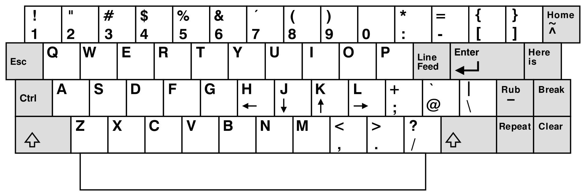

# ESC key

https://en.wikipedia.org/wiki/Esc_key

On computer keyboards, the `Esc` key (named *Escape key* in the international standard series ISO/IEC 9995) is a key used to *generate the escape character* (represented as ASCII code 27 in decimal, Unicode U+001B, or `Ctrl+[`).

The escape character,
* when sent from the keyboard to an app, is often interpreted by software as "stop", "cancel" or "exit",
* when sent from the computer to an external device (including many printers since the 1980s, computer terminals and Linux consoles, for example) marks the beginning of an escape sequence to specify operating modes or characteristics.

On modern keyboards, the ESC key is placed at the top left corner, a convention dating at least back to the original IBM PC keyboard, though the key itself originated decades earlier with teletypewriters.

## Symbol

`⎋` Symbol 2029 from ISO 7000 - Title/Meaning: Escape Function/description: To identify the control to cancel the current action or exit from the current state. Corresponds to Unicode character U+238B.

The keyboard symbol for the ESC key (which may be used when the usual Latin lettering "Esc" is not preferred for labelling the key) is standardized in ISO/IEC 9995-7 as symbol 29, and in ISO 7000 "Graphical symbols for use on equipment" as symbol ISO-7000-2029. This symbol is encoded in Unicode as U+238B broken circle with northwest arrow (⎋).

## Origins

The name of the equivalent key on some early Teletype Model 33 keyboards was labeled `Alt Mode...`, the alternative mode of operation causing the escapement to treat the following (one) character in a special way.

Much later, computer terminals that would use *escape sequences* would often take more than one following byte as part of a special sequence.

## Use

As most computer users are no longer concerned with the details of controlling their computer's peripherals, the task for which the escape sequences were originally designed, the escape key was appropriated by application programmers, most often to mean Stop.

### Windows
This use continues today in Microsoft Windows's method of escape as a shortcut in dialog boxes for No, Quit, Exit, Cancel, or Abort, as well as a common shortcut key for the Stop button in many web browsers, and to cancel drag and drop operations. 

On machines running Microsoft Windows, prior to the implementation of the Windows key on keyboards, the typical practice for invoking the "start" button was to hold down the Control key and press escape. This key combination still works as of Windows 10. Microsoft Windows makes use of `Esc` for many key shortcuts. Many of these shortcuts have been present since Windows 3.0, through Windows XP and later.

### macOS
In macOS, `Esc` usually closes or cancels a dialog box or sheet. The `⌘ Command` + `⌥ Option` + `⎋ Esc` combination opens the Force Quit dialog box, allowing users to end non-responsive applications. Another use for the Esc key, in combination with the Command key, is switching to Front Row, if installed.

In most computer games, the escape key is used as a pause button and/or as a way to bring up the in-game menu, usually containing ways to exit the program. This is despite the existence of a separate Pause/Break key.

### Vi

ADM-3A keyboard layout used in vi development, with escape in what is now the tab position

In the **vi** family of text editors, escape is used to switch modes. This usage is due to escape being conveniently placed in what is now the tab position on the ADM-3A terminal keyboard used to develop vi, though it is now inconveniently placed.

This is similar to how the extensive modifier keys in **Emacs** were easily used on the original keyboard (the space-cadet keyboard), being placed together, but these keys have now been spread around the keyboard, becoming more difficult to use.

The **TECO** editor uses ESC as a delimiter when used once, and as an execute key when used twice in a row.

## Refs

https://of-vim-and-vigor.blogspot.com/2012/01/bairuis-school-of-vim-fu.html
https://vim.fandom.com/wiki/Mapping_keys_in_Vim_-_Tutorial_(Part_1)#Creating_keymaps
https://www.youtube.com/watch?v=POqiBPACIXU&list=PL8tzorAO7s0jy7DQ3Q0FwF3BnXGQnDirs&index=12
http://derekwyatt.org/vim/tutorials/advanced/
https://www.gnu.org/software/bash/manual/bash.html#Command-Line-Editing
https://en.wikipedia.org/wiki/Control_key
http://xahlee.info/kbd/lisp_keyboards.html
https://en.wikipedia.org/wiki/Space-cadet_keyboard
https://en.wikipedia.org/wiki/Modifier_key
https://en.wikipedia.org/wiki/Alt_key
https://en.wikipedia.org/wiki/Esc_key
https://en.wikipedia.org/wiki/Windows_key
https://sdf.org/?tutorials/survival-teco-2.0
https://en.wikipedia.org/wiki/Super_key_(keyboard_button)
https://en.wikipedia.org/wiki/Bucky_bit
https://en.wikipedia.org/wiki/Shift_key
https://en.wikipedia.org/wiki/Symbolics#Symbolics_keyboard
