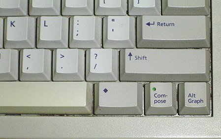

# Meta key

https://en.wikipedia.org/wiki/Meta_key

The Meta key is a modifier key on certain keyboards.

The Meta key first appeared on the SAIL (Stanford Artificial Intelligence Lab) keyboard in 1970, and its successors such as the Knight keyboard, *space-cadet keyboard*, MIT Lisp machine, Symbolics keyboards, and on Sun Microsystems keyboards (where it is marked with a black diamond `◆`).

Picture showing the `Compose key`, `Alt Graphic`, `Meta ◆`, `Shift ↑`, `Return ↲` keys; half of the conveniently - though abnormally - placed Backspace key and various letter keys on a Sun Type 5c keyboard. The Compose key has a LED, which lights up when the compose key is pressed, until the combination is completed.

Generally, the Meta key worked similar to Macintosh's Command key, in that when held down it modified letters and symbols into immediate commands (shortcuts).

On these keyboards the Control key was placed closest to the space bar, then the Meta key outside Control. The space-cadet keyboard added the Super key outside Meta, and the Hyper key outside that. All these keys produced shortcuts (2⁴ of them for every letter), but the Control ones were easiest to type and most popular, and the Meta ones second-easiest and thus second most popular. However, on most modern keyboards, the Control key is farthest from the space bar, reversing the convenience of shortcuts.

On keyboards that lack a physical Meta key, its functionality may be invoked by other keys such as the Windows key or Macintosh's Option key. However, software often provides another workaround, such as using the Alt key (which does not exist on the Knight keyboard), or using the Esc key as a prefix (e.g., in Emacs). Because of these workarounds, the need for Meta - despite being the most-used additional modifier key - was less than for other modifier keys. It is more common today to use the Windows key to emulate the Super key.
