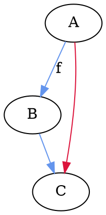
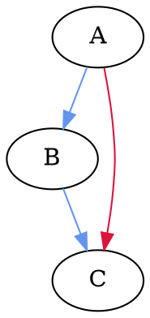
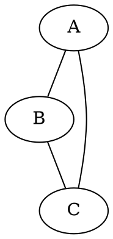
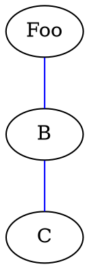
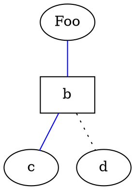
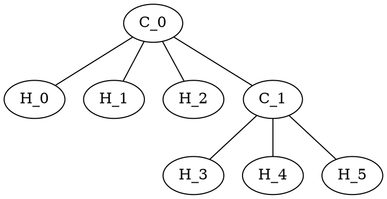
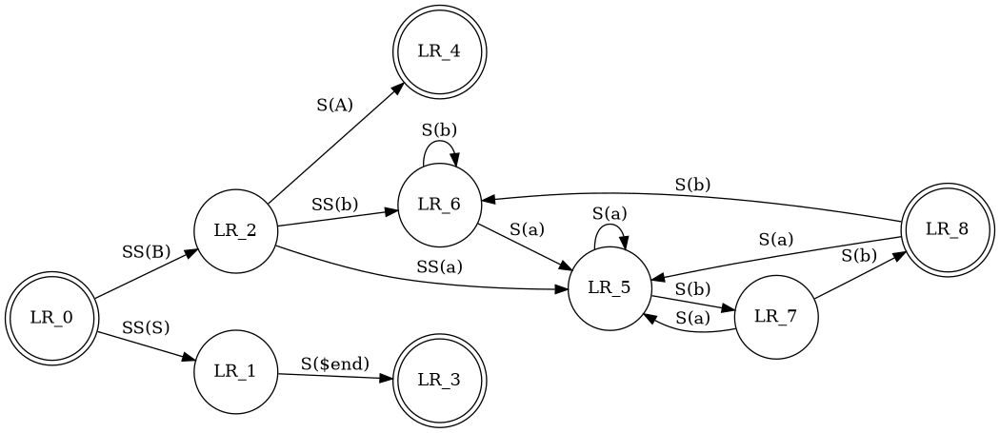

# MPE: Diagrams

## Diagrams

https://graphs.grevian.org/example

MPE uses [Viz.js](https://github.com/mdaines/viz.js) to render [dot language](https://en.wikipedia.org/wiki/DOT_(graph_description_language)) (GraphViz) diagram.

- https://en.wikipedia.org/wiki/DOT_(graph_description_language)
- place `viz` or `dot` annotation on code blocks
- choose engine by specifying `{engine="..."}`
- supported engines: *dot* (default), *circo*, *neato*, *osage*, *twopi*

> dot (default)

```dot
digraph {
A [label="a", shape=point];
B [shape=point];
C [shape=point];
A -> B [color=cornflowerblue];
B -> C [color=cornflowerblue];
A -> C [color=burlywood];
A -> A [color=crimson, style=dashed];
B -> B [color=crimson, style=dashed];
C -> C [color=crimson, style=dashed];
}
```

> dot

> circo

> neato

> osage

> twopi

## Attributes

Attributes control aspects such as color, shape, and line styles.
- For nodes and edges, one or more attribute/value pairs are placed in brackets after a statement and before the semicolon (which is optional).
- Graph attributes are specified as direct attribute/value pairs under the graph element, where multiple attributes are separated by a comma or using multiple sets of brackets
- Node attributes are placed after a statement containing only the name of the node, but not the relations between the dots.

> ethane molecule

> Finite Automaton

The `rankdir` and `orientation` request a left-to-right drawing in landscape mode. Note the use of text labels on edges.

