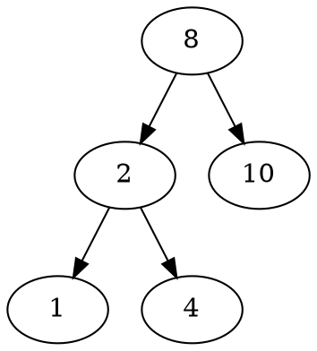

# md syntax


## Import md file

<!-- git book file include -->


<!-- markdown-preview-enhanced: import file 1 -->
@import "includeme.md"

<!-- markdown-preview-enhanced: import file 2 -->
<!-- @import "includeme.md" -->


## Summary and Details


<details><summary>Exrra</summary><br>

text text

</details><br>


<details>
<summary>Extra formatting</summary>

details: tasks
- [ ] Content to hide
- [ ] Use <kbd>pre tags</kbd>

details: list with formatting
- Use <kbd>kdb tag</kbd>
- [ ] Use <kbd>pre tags</kbd>
- make an empty line around details and summary tags

</details>


## Markup




log~2~n

30^th^

:smile:
:fa-car:

## footnote

In other words, non-monotonic logics are devised to capture and represent [defeasible inferences][^1] i.e. a kind of inference in which reasoners draw tentative conclusions, enabling reasoners to retract their conclusions based on further evidence.


## Tables

noun     | verb
---------|-------
licence  | license
practice | practise
advice   | advise

ok: github, gitbook

## Tasks
- [ ] and <kbd>tags</kbd> supported
- [x] list syntax required
- [x] this is a complete item
- [ ] this is an incomplete item

ok: github


## Extra formatting


<details>

<summary>Click_title</summary>

in details

</details>


## Linked Picture

```
this is a pic:
[!text] (/sys/account_pictures/ivan.jpg)

this is a linked pic:
[] (pic.jpg)

[](https://ci.appveyor.com/)
```


[^1]: Defeasible reasoning is a kind of reasoning that is rationally compelling although not deductively valid.
